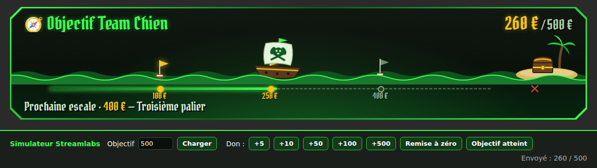
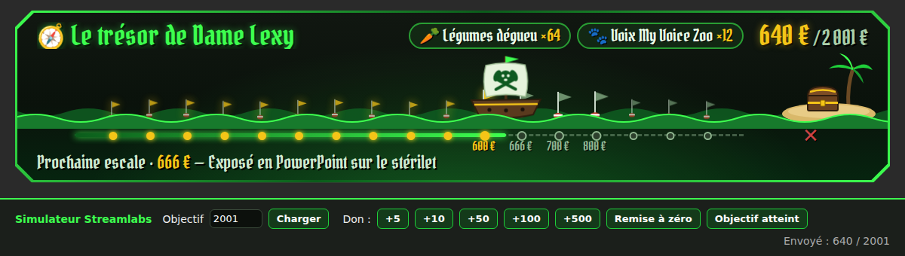

# Cap sur le trésor · objectif de dons G4P (Team Chien)

Widget d'objectif de dons pour **Gamers4Pets 2026** (thème pirate, Team Chien en vert).
Pas de barre qui se remplit : un navire pirate avance sur la mer vers une île au trésor au fil des dons.




## Ce que fait le widget

- **Le navire avance** selon le montant récolté, avec les vagues et le tangage animés.
- **Chaque palier est une bouée** : grise tant qu'il n'est pas atteint, dorée ensuite, avec un éclat lumineux au passage.
- **Un tracé de carte** sous la mer : pointillés pour ce qui reste, trait vert néon pour ce qui est parcouru, jusqu'au X.
- **Le texte du bas** affiche la prochaine escale (« Prochaine escale · 250 € — Allumage de la cam »).
- **Des compteurs de gages récurrents** en option (« tous les 10 € je mange un légume… ») qui pulsent quand ils augmentent.
- **Objectif atteint** : le coffre s'ouvre, le cadre passe à l'or et un message de fin s'affiche.
- **Beaucoup de paliers ?** Ils sont espacés régulièrement (réglable) : seuls le dernier atteint et les 3 suivants gardent leur montant affiché, les autres restent discrets.

Le montant et l'objectif viennent directement de Streamlabs, donc tout se met à jour tout seul à chaque don.

## Contenu du dossier

```
streamlabs/                      Code commun à tous les streamers
  1-HTML.html                    → onglet HTML du widget
  2-CSS.css                      → onglet CSS
  3-JS.js                        → onglet JS
  4-Champs-personnalises.json    → onglet Champs personnalisés (version de base)
streamers/
  lexywinchester/                Champs personnalisés de Lexy (18 paliers, compteurs légumes/voix)
test/
  TEST-base.html                 Simulateur : ouvrir dans un navigateur et cliquer sur les dons
  TEST-lexy.html                 Pareil avec la config de Lexy
  generer-test.py                Régénère les pages de test après une modif
obs-sans-streamlabs/
  cap-sur-le-tresor.html         Version autonome pour OBS (fichier local, montant réglé à la main)
apercus/                         Captures d'écran
```

## Installation sur Streamlabs

1. Sur le tableau de bord Streamlabs : Widgets > **Objectif de dons** (*Donation Goal*).
2. Crée l'objectif (titre + montant visé) et démarre-le.
3. Dans les réglages du widget, active **HTML/CSS personnalisé**.
4. Colle chaque fichier dans l'onglet qui correspond :
   - `streamlabs/1-HTML.html` → **HTML**
   - `streamlabs/2-CSS.css` → **CSS**
   - `streamlabs/3-JS.js` → **JS**
   - le fichier de champs du streamer → **Champs personnalisés** (à activer)
5. Enregistre, puis copie l'**URL du widget**.
6. Dans OBS : Sources > + > **Navigateur**, colle l'URL, taille **1200 × 270**.

⚠️ L'URL du widget est privée : ne pas la partager.

## Personnaliser pour un streamer

Pas besoin de toucher au code : tout se règle dans l'onglet **Champs personnalisés**.

| Champ | Exemple | Rôle |
|---|---|---|
| Paliers | `5 = Allumage du micro \| 25 = Allumage de la cam` | Un palier par bloc, séparés par `\|`. Le format `5€ - texte` marche aussi. |
| Objectif final | `2001` | Force l'objectif. Vide = celui de Streamlabs. |
| Gages récurrents | `10 = 🥕 Légumes \| 50 = 🐾 Voix` | Compteurs « tous les X € ». Vide = pas de compteur. |
| Espacement des paliers | Régulier / Proportionnel | Régulier conseillé dès qu'il y a beaucoup de paliers. |
| Devise | `€` | |
| Texte de fin | `Merci à tout l'équipage 🐾` | Affiché quand l'objectif est atteint. |
| Titre par défaut | `Cap sur le trésor` | Utilisé si l'objectif Streamlabs n'a pas de titre. |

Pour un nouveau streamer : copier `streamlabs/4-Champs-personnalises.json` dans `streamers/<pseudo>/` et modifier les valeurs `"value"`.

## Tester

- **Sans Streamlabs :** ouvrir `test/TEST-base.html` ou `test/TEST-lexy.html` dans un navigateur. La barre du bas envoie les mêmes événements que Streamlabs (`goalLoad` et `goalEvent`).
- **Après une modif du code** ou d'un fichier de champs, régénérer la page de test :
  ```
  python3 test/generer-test.py streamers/lexywinchester/4-Champs-personnalises.json test/TEST-lexy.html 2001 "Le trésor de Dame Lexy"
  ```
- **Sur Streamlabs :** mettre un montant de départ dans l'objectif, ou ajouter un don manuel. Le bouton « Tester » des alertes ne fait souvent pas bouger l'objectif.

## Problèmes connus

- **L'objectif affiché n'est pas le bon (ex. 10 000 € au lieu de 2001 €)** : Streamlabs envoie un autre objectif (objectif non démarré ou mal réglé). Remplir le champ **Objectif final**.
- **Le montant est trop élevé dès le départ** : le widget lit probablement une cagnotte d'équipe au lieu de celle du streamer.
- **Police pirate absente** : elle vient de Google Fonts (Pirata One), il faut une connexion internet. Sinon la barre s'affiche avec une police classique.

## Détails techniques

- Aucune dépendance : HTML, CSS et JS natifs, les illustrations sont en SVG dans le HTML.
- Les champs personnalisés sont lus depuis des `<div>` cachés, pas depuis des attributs : les guillemets dans les textes de paliers ne cassent rien.
- Le widget écoute `goalLoad` (au chargement) et `goalEvent` (à chaque don), et lit `detail.title`, `detail.amount.current` et `detail.amount.target`.
