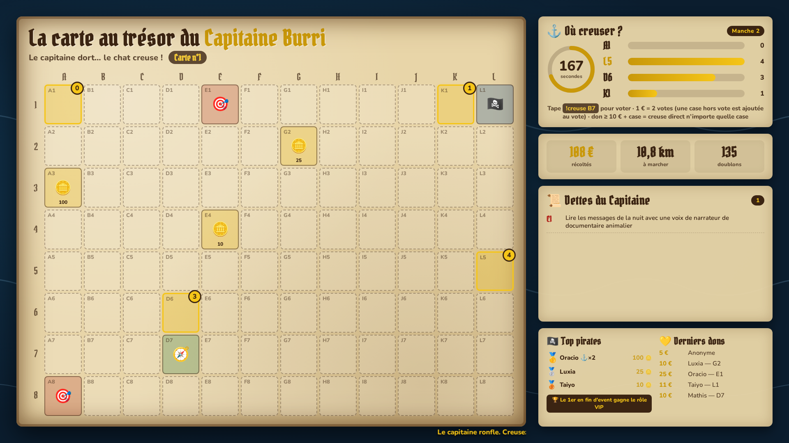
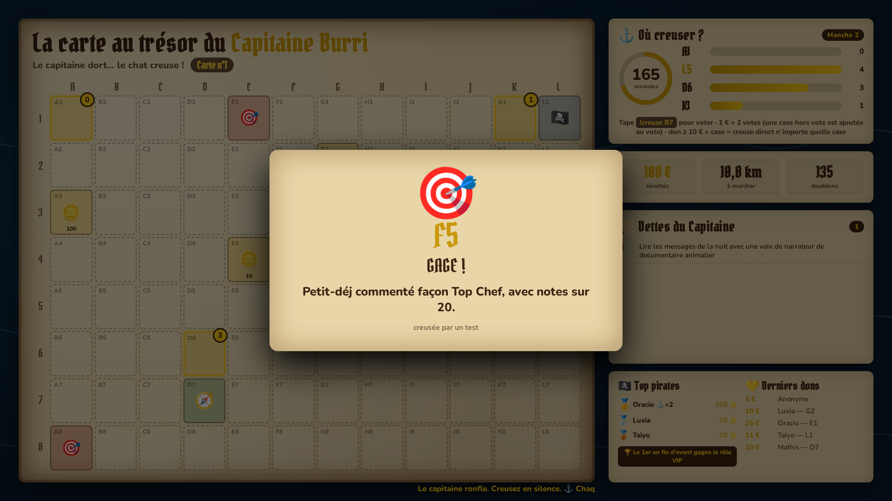
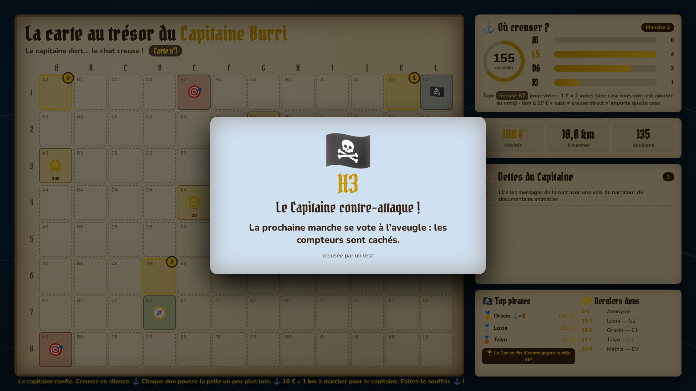
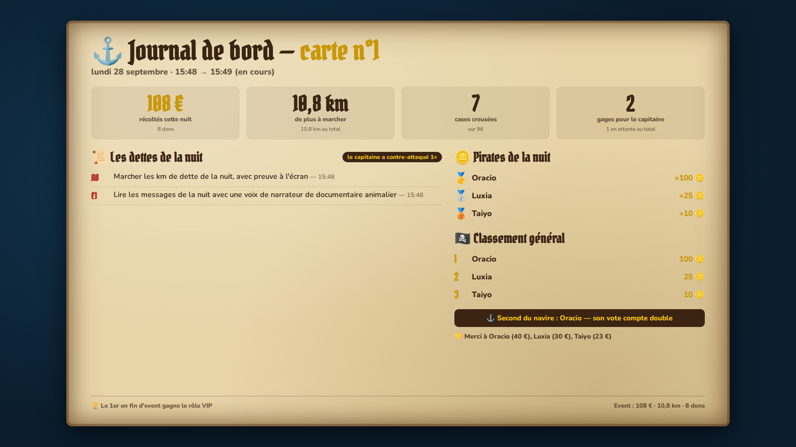
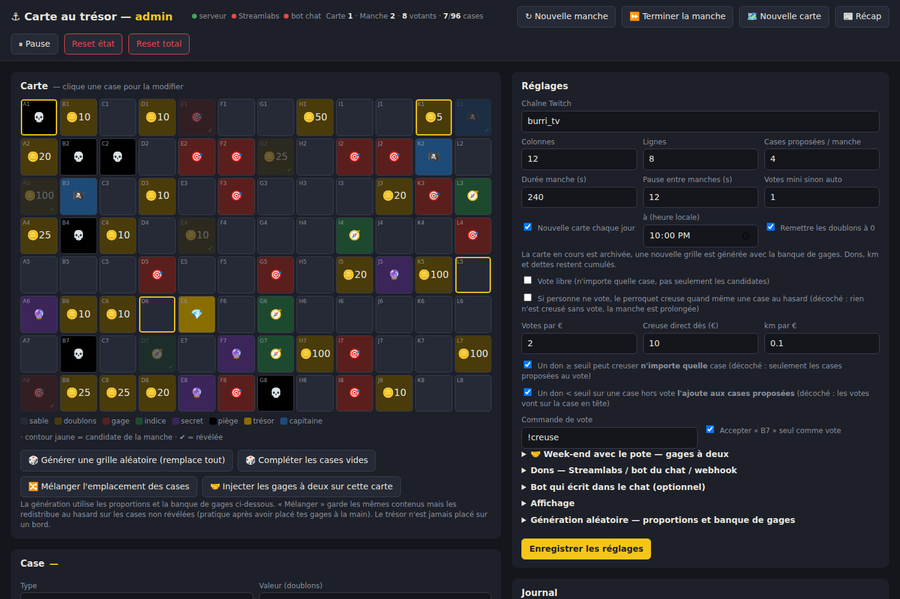

# Carte au trésor · jeu de nuit G4P (stream 24h/24)

Jeu interactif pour les nuits de **Gamers4Pets 2026** (thème pirate) : pendant que Burri dort, le chat vote pour creuser des cases sur une carte au trésor, et les dons font avancer la pelle. Les gages découverts s'accumulent dans les « Dettes du Capitaine », à exécuter au réveil.

Pensé pour tourner **sans personne aux commandes** : aucun son, rien à faire la nuit, tout repart tout seul si ça plante.



## Ce que fait le jeu

- **Une carte de 12 × 8 cases** avec des cases qui cachent du sable, des doublons, des gages, des indices, des paliers cachés, des pièges, des effets « Capitaine » et un trésor.
- **Des manches de 4 min** : 4 cases proposées au vote, le chat tape `!creuse B7` (ou juste `B7`) et la case gagnante s'ouvre en plein écran. **S'il n'y a aucun vote, aucune case n'est creusée** : la manche est simplement prolongée.
- **Les dons comptent** : 1 € = 2 votes sur la case citée dans le message. Un don de 10 € ou plus avec une case la **creuse tout de suite**, n'importe où sur la carte. Tous les 10 €, 1 km de plus à marcher pour le capitaine.
- **Une nouvelle carte chaque soir à 22h** : nouvelle grille, nouveau trésor. Les dons, les km, les dettes et le classement restent cumulés sur toute la semaine.
- **Un classement des pirates** : les doublons d'une case vont à tous ceux qui ont voté pour elle. Le 1er devient **Second du navire** (son vote compte double) et gagne le **rôle VIP** à la fin de l'event.
- **Des cases « Capitaine »** qui compliquent un peu la vie du chat (brouillard sur les votes, manche éclair, cases englouties, dette effacée…).
- **Des gages à deux pour le week-end** : ajoutés automatiquement certains jours, à faire avec un pote (ensemble ou « infligés » par lui).
- **Un récap du matin** : une page 1920×1080 avec la nuit résumée (dons, gages, trésor, meilleurs pirates), plus une version texte à coller sur Discord ou X.

| Révélation d'un gage | Effet Capitaine |
|---|---|
|  |  |

| Récap du matin | Page d'admin |
|---|---|
|  |  |

## Contenu du dossier

```
server.js              Le serveur : chat Twitch, dons, manches, sauvegarde
config.default.json    Réglages et textes par défaut (gages, paliers cachés, gage ultime…)
public/
  overlay.html         L'écran du jeu, à mettre dans OBS
  admin.html           La page de contrôle (réglages, placement des cases, tests)
  recap.html           Le récap du matin
start.bat / start.sh   Lancement + relance automatique en cas de plantage
data/                  Créé au lancement : config.json (ta config) et state.json (la partie en cours)
apercus/               Captures d'écran
```

## Installation

1. Installer **Node.js** (version LTS) : https://nodejs.org
2. Copier le dossier `g4p-carte-au-tresor` sur le PC du stream.
3. Double-cliquer sur **`start.bat`**. Le premier lancement installe les dépendances (environ 30 s). Laisser la fenêtre ouverte toute la semaine.
4. Ouvrir **http://localhost:3000/admin.html** : c'est la page de contrôle.
5. Dans OBS : Sources > + > **Navigateur**, URL `http://localhost:3000/overlay`, taille **1920 × 1080**.
6. Pour le réveil : une autre source navigateur sur `http://localhost:3000/recap`.

Le serveur n'écoute qu'en local (`127.0.0.1`) : personne d'autre ne peut ouvrir l'admin.

## Avant le premier live

Dans l'admin, onglet **Réglages** :

- **Chaîne Twitch** : `burri_tv`. Lire le chat ne demande aucun token.
- **Dons** : coller le **Socket API Token** Streamlabs (Streamlabs > Settings > API Settings). Ça capte les dons Streamlabs et Streamlabs Charity en direct.
- **Bot** (gratuit, conseillé) : un compte Twitch + un token créé sur twitchtokengenerator.com (`chat:read` + `chat:edit`). Mettre le compte modérateur de la chaîne, puis cocher « Annoncer les révélations et les dons ». La nuit, c'est ce qui explique le jeu aux gens sur mobile.
- **Textes** : relire la banque de gages, les paliers cachés et le gage ultime, puis cliquer sur **Générer une grille aléatoire**.
- **Week-end avec le pote** : son prénom (il remplace `{pote}` dans les textes) et les dates.
- **Tester** avec la section 🧪 Tests, en gardant l'overlay ouvert à côté.
- Juste avant de lancer : **Reset total**, pour effacer les tests.

## Pendant l'event

| Bouton | Quand s'en servir |
|---|---|
| Pause | Pendant un raid ou une coupure. Les dons continuent de compter. |
| Nouvelle carte | Elle est créée automatiquement à 22h, ce bouton sert à forcer. |
| 🔀 Mélanger | Après avoir placé des cases à la main, pour ne plus savoir où elles sont. |
| 🤝 Injecter les gages à deux | Quand le pote arrive en cours de carte. |
| Reset état | Pour vider la carte, les dons et les dettes. **Garde le classement.** |
| Reset total | Efface tout, classement compris. À faire seulement avant l'event. |

Les dettes se cochent dans l'admin une fois qu'elles sont faites.

## Règles pour le chat

| Action | Effet |
|---|---|
| `!creuse B7` ou `B7` | Vote pour la case (un vote par personne, c'est le dernier qui compte) |
| Don + case proposée | +2 votes par € sur cette case |
| Don + case hors vote | La case est ajoutée au vote, avec ses votes bonus |
| Don ≥ 10 € + case | La case est creusée tout de suite, n'importe où sur la carte |
| Don sans case | Les votes vont sur la case en tête |

Commandes auxquelles le bot répond :

| Commande | Réponse |
|---|---|
| `!moi` | Doublons, rang et titre de la personne |
| `!classement` | Le top 5 |
| `!dettes` | Les dettes en attente |
| `!carte` / `!regles` | Les règles en une ligne |

## Types de cases

| Case | Effet |
|---|---|
| Sable | Rien |
| Doublons | Répartis entre les votants de la case, pour le classement |
| Gage | Ajouté aux dettes : au réveil, ou au prochain live |
| Indice | Donne un indice sur l'emplacement du trésor (généré automatiquement) |
| Secret | Révèle un palier de dons caché |
| Piège | Fait perdre des doublons aux votants, avec parfois un gage |
| Capitaine | Un petit malus pour le chat (voir ci-dessous) |
| Trésor | Le gage ultime, un seul par carte |

Effets Capitaine : **Amnistie** (efface la dernière dette), **Vent arrière** (retire des km), **Brouillard** (votes cachés à la manche suivante), **Manche éclair** (durée divisée par 2), **Rats dans la cale** (le 1er du classement perd des doublons), **Sommeil profond** (seuil de creuse directe doublé pendant 2 manches), **Marée haute** (2 cases deviennent impossibles à creuser).

## Brancher les dons autrement

Si les dons de l'event n'arrivent pas par Streamlabs, deux autres solutions, qui peuvent s'ajouter à la première (un même don n'est jamais compté deux fois) :

- **Un bot annonce les dons dans le chat** : renseigner son nom et une regex avec les groupes `nom` et `montant`, par exemple `^(?<nom>.+?) vient de faire un don de (?<montant>[\d.,]+)`.
- **Webhook** : `POST http://localhost:3000/api/don` avec `{"nom":"X","montant":12,"message":"B7"}`.

## Problèmes connus

- **Un palier caché est découvert une deuxième fois** : chaque carte reprend les premières lignes de la liste des secrets. Retirer le lendemain les paliers déjà découverts.
- **Le trésor revient chaque nuit** : le gage ultime doit pouvoir se faire plusieurs fois, ou il faut changer son texte avant 22h.
- **Police pirate absente** : elle vient de Google Fonts (Pirata One), il faut une connexion internet.
- **Une ancienne config reste active après une mise à jour** : c'est `data/config.json` qui compte, pas `config.default.json`. Le supprimer pour repartir des nouveaux réglages par défaut.

## Détails techniques

- Node.js + Express, WebSocket (`ws`) pour l'overlay et l'admin, `tmi.js` pour le chat Twitch, `socket.io-client` pour Streamlabs.
- L'état est sauvegardé dans `data/state.json` à chaque changement, en écriture atomique. Un redémarrage ne perd rien.
- L'overlay ne reçoit jamais les tokens : ils restent côté serveur.
- Page de récap : `/recap` (carte en cours) ou `/recap?carte=prev`. Version texte : `/api/recap.txt`.
